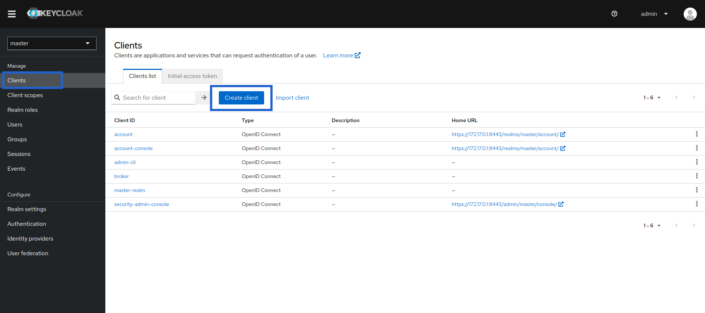
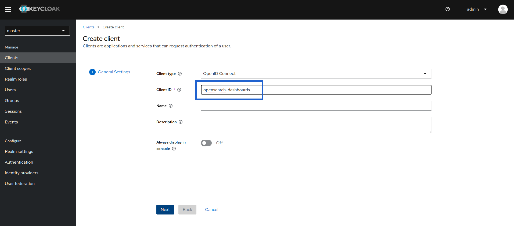
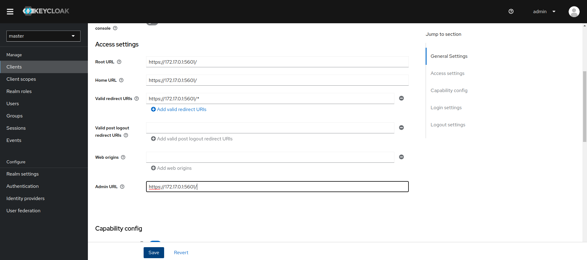
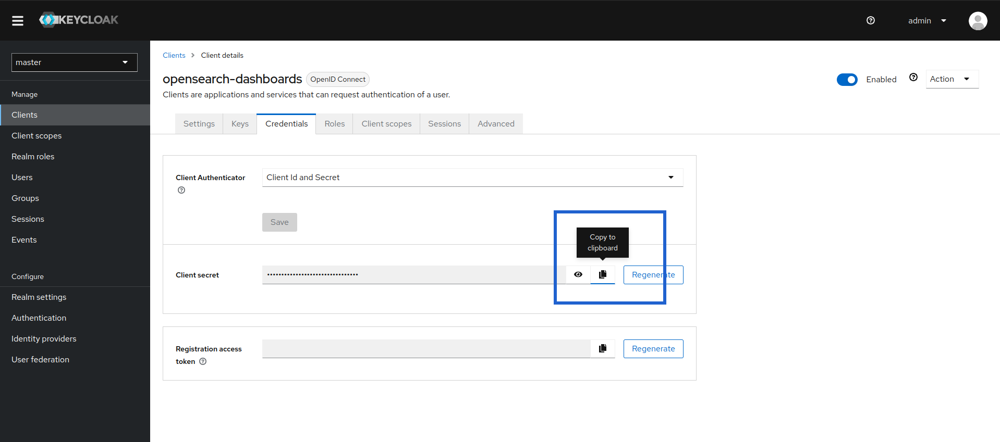

# Docker Opensearch Keycloak (>17)

3 nodes architecture

## Versions

- Opensearch and Opensearch-Dashboards : **2.4.1**
- Keycloak : **20**
- Postgres (used for Keycloak) : **15**

## Setup

1. Important settings

    As specified in [opensearch documentation important settings](https://opensearch.org/docs/latest/install-and-configure/install-opensearch/index/#important-settings), we will increase `vm.map_max_count` value, which is the maximum number of memory map areas a process may have.

    To increase the value, add the following line to /etc/sysctl.conf:

    ```txt
    vm.max_map_count=262144
    ```

    Then run `sudo sysctl -p` to reload.

2. Generate certificates

    This bash script will generate a root ca, an admin certificate (will be used to run securityadmin script later), a certificate for Keycloak, a certificate for opensearch nodes and one for opensearch dashboard.

    ```bash
    bash generate_certs.sh
    ```

3. Start and configure Keycloak

    Open the `.env` file and edit admin credentials. Default is to `admin:admin`.

    ```bash
    KEYCLOAK_ADMIN_USER=admin
    KEYCLOAK_ADMIN_PASSWORD=admin
    ```

    Start keycloak

    ```bash
    docker-compose up -d keycloak
    # or docker compose depending on your setup
    docker compose up -d keycloak
    ```

    Create opensearch-dashboards Keycloak client

    When keycloak container is healthy, go to <https://172.17.0.1:8443>, click on `Administration console` and log in with admin credentials you specified in `.env` file.

    Click on `Clients` and `Create client`
    

    Edit `Client ID` to match `opensearch_security.openid.client_id` configured in [opensearch-dashboards.yml](./config/opensearch-dashboards.yml)
    

    Configure `Access settings`
    

    Once created and saved, copy `opensearch-dashboards` client `secret` and paste it in `opensearch_security.openid.client_secret` field in [opensearch-dashboards.yml](./config/opensearch-dashboards.yml)
    

4. Start and configure Opensearch

    Start Opensearch

    ```bash
    docker-compose up -d opensearch-node1 opensearch-node2 opensearch-node3
    ```

    Wait a little until nodes are ready and then run securityadmin

    ```bash
    docker-compose exec opensearch-node1 bash -c "chmod +x plugins/opensearch-security/tools/securityadmin.sh && bash plugins/opensearch-security/tools/securityadmin.sh -cd config/opensearch-security -icl -nhnv -cacert config/certificates/ca/root-ca.pem -cert config/certificates/ca/admin.pem -key config/certificates/ca/admin.key -h localhost"
    ```

5. Start Opensearch Dashboards

    ```bash
    docker-compose up -d opensearch-dashboards
    ```

    Opensearch Dashboards will be available at <https://172.17.0.1:5601> and you can log in with credentials specified in `.env` file.
